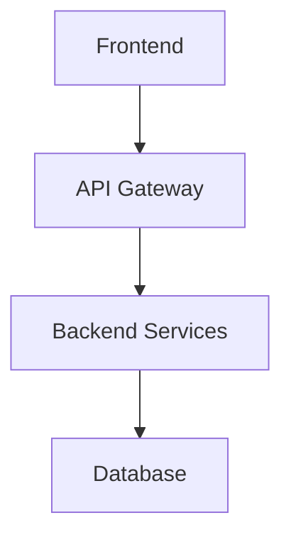
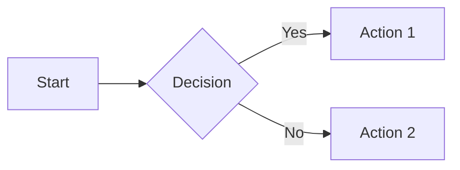

# Documentation

This directory contains the documentation for the FastAPI Angular Boilerplate project, built with [MkDocs](https://www.mkdocs.org/) and [Material for MkDocs](https://squidfunk.github.io/mkdocs-material/).

## Quick Start

### 1. Install Dependencies

```bash
# Install documentation dependencies
uv sync --group docs

# Or use the convenience script
./scripts/docs.sh install
```

### 2. Start Development Server

```bash
# Start the documentation server
uv run mkdocs serve

# Or use the convenience script
./scripts/docs.sh serve
```

The documentation will be available at http://localhost:8001

### 3. Build Documentation

```bash
# Build static documentation
uv run mkdocs build

# Or use the convenience script
./scripts/docs.sh build
```

## Structure

```
docs/
├── README.md                    # This file
├── index.md                     # Homepage
├── getting-started/             # Getting started guides
│   ├── installation.md
│   ├── configuration.md
│   └── running.md
├── backend/                     # Backend documentation
│   ├── architecture.md
│   └── api.md
├── frontend/                    # Frontend documentation
│   └── overview.md
├── deployment/                  # Deployment guides
│   └── docker.md
├── development/                 # Development guides (to be added)
└── gen_ref_pages.py            # API reference generator
```

## Features

### Material Design Theme

The documentation uses the Material for MkDocs theme with:

-   **Dark/Light Mode Toggle**: Automatic theme switching
-   **Navigation**: Tabs, sections, and search
-   **Code Highlighting**: Syntax highlighting for multiple languages
-   **Responsive Design**: Mobile-friendly layout

### Mermaid Diagrams

Support for Mermaid diagrams for architecture and flow charts:



### Code Documentation

Automatic API documentation generation from Python docstrings using mkdocstrings (currently disabled but can be enabled).

### Markdown Extensions

Enhanced Markdown support with:

-   **Admonitions**: Warning, info, and tip boxes
-   **Code Blocks**: Syntax highlighting and line numbers
-   **Tables**: Enhanced table formatting
-   **Task Lists**: Interactive checkboxes
-   **Footnotes**: Reference-style footnotes

## Configuration

The documentation is configured in `mkdocs.yml`:

```yaml
site_name: FastAPI Angular Boilerplate
theme:
    name: material
    palette:
        - scheme: default
          primary: blue
          toggle:
              icon: material/brightness-7
              name: Switch to dark mode
        - scheme: slate
          primary: blue
          toggle:
              icon: material/brightness-4
              name: Switch to light mode
```

## Writing Documentation

### Adding New Pages

1. Create a new Markdown file in the appropriate directory
2. Add it to the navigation in `mkdocs.yml`:

```yaml
nav:
    - Home: index.md
    - Your Section:
          - New Page: section/new-page.md
```

### Using Admonitions

```markdown
!!! note "Note Title"
This is a note admonition.

!!! warning
This is a warning without a title.

!!! tip "Pro Tip"
This is a helpful tip.
```

### Adding Code Examples

````markdown
```python title="example.py" linenums="1"
def hello_world():
    print("Hello, World!")
```
````

### Creating Diagrams

````markdown

````

### Cross-References

```markdown
# Link to other pages

[Installation Guide](getting-started/installation.md)

# Link to sections

[Configuration Section](getting-started/configuration.md#environment-variables)

# External links

[FastAPI Documentation](https://fastapi.tiangolo.com/)
```

## Deployment

### GitHub Pages

To deploy to GitHub Pages:

```bash
# Deploy to gh-pages branch
uv run mkdocs gh-deploy

# Or use the convenience script
./scripts/docs.sh deploy
```

### Manual Deployment

1. Build the documentation:

    ```bash
    uv run mkdocs build
    ```

2. Deploy the `site/` directory to your web server.

### Docker Deployment

You can also serve the documentation using Docker:

```dockerfile
FROM nginx:alpine
COPY site/ /usr/share/nginx/html/
EXPOSE 80
CMD ["nginx", "-g", "daemon off;"]
```

## Development Workflow

### Adding New Documentation

1. **Create the file**: Add a new `.md` file in the appropriate directory
2. **Update navigation**: Add the page to `mkdocs.yml` navigation
3. **Preview changes**: Use `mkdocs serve` to preview
4. **Build and test**: Run `mkdocs build` to ensure no errors

### Content Guidelines

-   **Use clear headings**: Structure content with proper heading hierarchy
-   **Add examples**: Include code examples and practical use cases
-   **Keep it current**: Update documentation when code changes
-   **Link related content**: Use cross-references between related topics
-   **Use admonitions**: Highlight important information with notes/warnings

### Troubleshooting

#### Build Errors

If you encounter build errors:

1. Check for syntax errors in Markdown files
2. Verify all linked files exist
3. Check `mkdocs.yml` configuration
4. Review plugin configurations

#### Missing Dependencies

If plugins are missing:

```bash
# Reinstall documentation dependencies
uv sync --group docs --force
```

#### Broken Links

MkDocs will warn about broken links during build. Fix them by:

1. Checking file paths are correct
2. Ensuring referenced files exist
3. Using relative paths correctly

## Contributing

When contributing documentation:

1. **Follow the style guide**: Use consistent formatting and structure
2. **Test your changes**: Always preview with `mkdocs serve`
3. **Update navigation**: Add new pages to the navigation
4. **Check links**: Ensure all links work correctly
5. **Add examples**: Include practical examples where helpful

## Scripts

The `scripts/docs.sh` script provides convenient commands:

```bash
./scripts/docs.sh help      # Show available commands
./scripts/docs.sh install   # Install dependencies
./scripts/docs.sh serve     # Start development server
./scripts/docs.sh build     # Build documentation
./scripts/docs.sh deploy    # Deploy to GitHub Pages
./scripts/docs.sh clean     # Clean build directory
```

## Resources

-   [MkDocs Documentation](https://www.mkdocs.org/)
-   [Material for MkDocs](https://squidfunk.github.io/mkdocs-material/)
-   [Mermaid Diagrams](https://mermaid-js.github.io/mermaid/)
-   [Python Markdown Extensions](https://python-markdown.github.io/extensions/)
