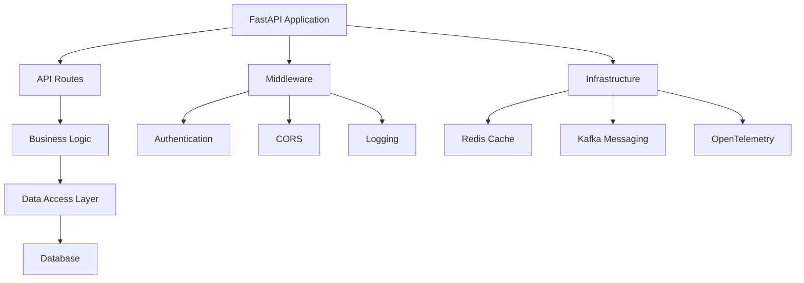

# Backend Architecture

The FastAPI backend follows a clean architecture pattern with clear separation of concerns, making it maintainable, testable, and scalable.

## Overview



## Project Structure

```
rest_angular/
├── __init__.py          # Package initialization
├── __main__.py          # Application entry point
├── app.py              # FastAPI application setup
├── config.py           # Configuration management
├── infra/              # Infrastructure components
│   ├── cache/          # Redis caching
│   ├── database/       # Database connections
│   ├── messaging/      # Kafka messaging
│   └── monitoring/     # OpenTelemetry setup
├── migrations/         # Alembic database migrations
├── modules/            # Business logic modules
│   ├── auth/          # Authentication module
│   ├── users/         # User management
│   └── ...            # Other business modules
└── static/            # Static files
```

## Core Components

### 1. Application Factory (`app.py`)

The main FastAPI application is created using the factory pattern:

```python
from fastapi import FastAPI
from fastapi.middleware.cors import CORSMiddleware

def create_app() -> FastAPI:
    app = FastAPI(
        title="REST Angular API",
        description="FastAPI backend for Angular frontend",
        version="0.1.0"
    )

    # Add middleware
    setup_middleware(app)

    # Register routes
    register_routes(app)

    # Setup infrastructure
    setup_infrastructure(app)

    return app
```

### 2. Configuration Management (`config.py`)

Configuration is managed using Pydantic Settings:

```python
from pydantic import BaseSettings
from typing import List

class Settings(BaseSettings):
    # Application settings
    environment: str = "dev"
    debug: bool = False

    # Database settings
    database_url: str

    # Redis settings
    redis_url: str

    # Authentication settings
    secret_key: str
    algorithm: str = "HS256"

    class Config:
        env_file = ".env"
```

### 3. Database Layer

#### SQLAlchemy Models

Models are defined using SQLAlchemy ORM:

```python
from sqlalchemy import Column, Integer, String, DateTime
from sqlalchemy.ext.declarative import declarative_base

Base = declarative_base()

class User(Base):
    __tablename__ = "users"

    id = Column(Integer, primary_key=True)
    email = Column(String, unique=True, index=True)
    hashed_password = Column(String)
    created_at = Column(DateTime, default=datetime.utcnow)
```

#### Database Sessions

Async database sessions are managed with dependency injection:

```python
from sqlalchemy.ext.asyncio import AsyncSession
from fastapi import Depends

async def get_db_session() -> AsyncSession:
    async with async_session() as session:
        try:
            yield session
            await session.commit()
        except Exception:
            await session.rollback()
            raise
        finally:
            await session.close()
```

### 4. API Routes

Routes are organized by modules using APIRouter:

```python
from fastapi import APIRouter, Depends
from sqlalchemy.ext.asyncio import AsyncSession

router = APIRouter(prefix="/api/users", tags=["users"])

@router.get("/")
async def get_users(
    db: AsyncSession = Depends(get_db_session)
):
    # Business logic here
    pass

@router.post("/")
async def create_user(
    user_data: UserCreate,
    db: AsyncSession = Depends(get_db_session)
):
    # Business logic here
    pass
```

### 5. Authentication

Authentication is handled using FastAPI Users:

```python
from fastapi_users import FastAPIUsers
from fastapi_users.authentication import JWTAuthentication

# JWT authentication
jwt_authentication = JWTAuthentication(
    secret=SECRET,
    lifetime_seconds=3600,
    tokenUrl="auth/jwt/login",
)

# FastAPI Users instance
fastapi_users = FastAPIUsers(
    user_manager,
    [jwt_authentication],
)

# Current user dependency
current_active_user = fastapi_users.current_user(active=True)
```

## Infrastructure Components

### 1. Redis Cache

Caching layer using Redis:

```python
import redis.asyncio as redis
from fastapi import Depends

class CacheService:
    def __init__(self, redis_client: redis.Redis):
        self.redis = redis_client

    async def get(self, key: str) -> str | None:
        return await self.redis.get(key)

    async def set(self, key: str, value: str, expire: int = 3600):
        await self.redis.set(key, value, ex=expire)

    async def delete(self, key: str):
        await self.redis.delete(key)

# Dependency
async def get_cache_service() -> CacheService:
    redis_client = redis.from_url(settings.redis_url)
    return CacheService(redis_client)
```

### 2. Kafka Messaging

Message broker integration:

```python
from aiokafka import AIOKafkaProducer, AIOKafkaConsumer

class MessageService:
    def __init__(self):
        self.producer = None
        self.consumer = None

    async def start_producer(self):
        self.producer = AIOKafkaProducer(
            bootstrap_servers=settings.kafka_bootstrap_servers
        )
        await self.producer.start()

    async def send_message(self, topic: str, message: dict):
        await self.producer.send(
            topic,
            json.dumps(message).encode()
        )

    async def consume_messages(self, topic: str):
        self.consumer = AIOKafkaConsumer(
            topic,
            bootstrap_servers=settings.kafka_bootstrap_servers
        )
        await self.consumer.start()

        async for message in self.consumer:
            yield json.loads(message.value.decode())
```

### 3. OpenTelemetry Monitoring

Observability setup:

```python
from opentelemetry import trace
from opentelemetry.exporter.otlp.proto.grpc.trace_exporter import OTLPSpanExporter
from opentelemetry.sdk.trace import TracerProvider
from opentelemetry.sdk.trace.export import BatchSpanProcessor

def setup_tracing():
    trace.set_tracer_provider(TracerProvider())
    tracer = trace.get_tracer(__name__)

    otlp_exporter = OTLPSpanExporter(
        endpoint=settings.otlp_endpoint
    )

    span_processor = BatchSpanProcessor(otlp_exporter)
    trace.get_tracer_provider().add_span_processor(span_processor)

    return tracer
```

## Middleware Stack

### 1. CORS Middleware

```python
from fastapi.middleware.cors import CORSMiddleware

app.add_middleware(
    CORSMiddleware,
    allow_origins=settings.allowed_origins,
    allow_credentials=True,
    allow_methods=["*"],
    allow_headers=["*"],
)
```

### 2. Authentication Middleware

```python
from fastapi import Request, HTTPException
from fastapi.security import HTTPBearer

security = HTTPBearer()

async def authenticate_request(request: Request):
    try:
        token = await security(request)
        # Verify token
        payload = jwt.decode(token.credentials, SECRET, algorithms=[ALGORITHM])
        return payload
    except JWTError:
        raise HTTPException(status_code=401, detail="Invalid token")
```

### 3. Logging Middleware

```python
import logging
from fastapi import Request
import time

logger = logging.getLogger(__name__)

async def log_requests(request: Request, call_next):
    start_time = time.time()

    logger.info(f"Request: {request.method} {request.url}")

    response = await call_next(request)

    process_time = time.time() - start_time
    logger.info(f"Response: {response.status_code} ({process_time:.3f}s)")

    return response
```

## Error Handling

### Global Exception Handler

```python
from fastapi import HTTPException, Request
from fastapi.responses import JSONResponse

@app.exception_handler(HTTPException)
async def http_exception_handler(request: Request, exc: HTTPException):
    return JSONResponse(
        status_code=exc.status_code,
        content={
            "error": exc.detail,
            "status_code": exc.status_code,
            "path": request.url.path
        }
    )

@app.exception_handler(Exception)
async def general_exception_handler(request: Request, exc: Exception):
    logger.error(f"Unhandled exception: {exc}", exc_info=True)
    return JSONResponse(
        status_code=500,
        content={
            "error": "Internal server error",
            "status_code": 500
        }
    )
```

### Custom Exceptions

```python
class BusinessLogicError(Exception):
    def __init__(self, message: str, status_code: int = 400):
        self.message = message
        self.status_code = status_code
        super().__init__(self.message)

class UserNotFoundError(BusinessLogicError):
    def __init__(self, user_id: int):
        super().__init__(f"User with id {user_id} not found", 404)
```

## Dependency Injection

FastAPI's dependency injection system is used throughout:

```python
from fastapi import Depends
from typing import Annotated

# Database dependency
DatabaseDep = Annotated[AsyncSession, Depends(get_db_session)]

# Cache dependency
CacheDep = Annotated[CacheService, Depends(get_cache_service)]

# Current user dependency
CurrentUserDep = Annotated[User, Depends(current_active_user)]

# Usage in routes
@router.get("/profile")
async def get_profile(
    current_user: CurrentUserDep,
    db: DatabaseDep,
    cache: CacheDep
):
    # Use dependencies
    pass
```

## Testing Architecture

### Test Database

```python
import pytest
from sqlalchemy.ext.asyncio import create_async_engine, AsyncSession

@pytest.fixture
async def test_db():
    engine = create_async_engine("sqlite+aiosqlite:///test.db")

    async with engine.begin() as conn:
        await conn.run_sync(Base.metadata.create_all)

    async with AsyncSession(engine) as session:
        yield session

    async with engine.begin() as conn:
        await conn.run_sync(Base.metadata.drop_all)
```

### Test Client

```python
from fastapi.testclient import TestClient
from httpx import AsyncClient

@pytest.fixture
async def client():
    async with AsyncClient(app=app, base_url="http://test") as ac:
        yield ac
```

## Performance Considerations

### 1. Connection Pooling

```python
from sqlalchemy.pool import QueuePool

engine = create_async_engine(
    database_url,
    poolclass=QueuePool,
    pool_size=20,
    max_overflow=0,
    pool_pre_ping=True
)
```

### 2. Caching Strategy

```python
from functools import wraps

def cached(expire: int = 3600):
    def decorator(func):
        @wraps(func)
        async def wrapper(*args, **kwargs):
            cache_key = f"{func.__name__}:{hash(str(args) + str(kwargs))}"

            # Try to get from cache
            cached_result = await cache.get(cache_key)
            if cached_result:
                return json.loads(cached_result)

            # Execute function and cache result
            result = await func(*args, **kwargs)
            await cache.set(cache_key, json.dumps(result), expire)

            return result
        return wrapper
    return decorator
```

### 3. Background Tasks

```python
from fastapi import BackgroundTasks

async def send_email(email: str, message: str):
    # Send email asynchronously
    pass

@router.post("/send-notification")
async def send_notification(
    background_tasks: BackgroundTasks,
    email: str,
    message: str
):
    background_tasks.add_task(send_email, email, message)
    return {"message": "Notification queued"}
```

## Next Steps

-   [API Documentation](api.md) - Explore the API endpoints
-   [Database Guide](database.md) - Learn about database operations
-   [Authentication](auth.md) - Understand the authentication system
