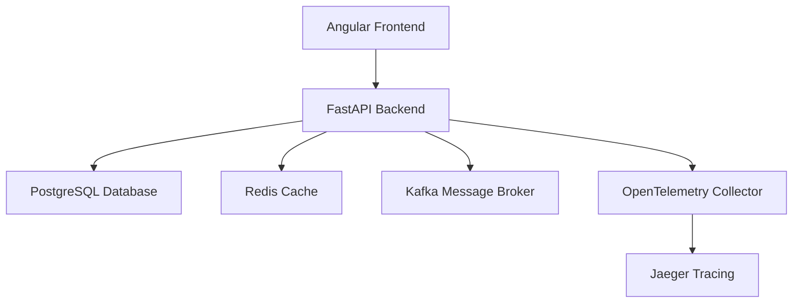

# FastAPI Angular Boilerplate

Welcome to the FastAPI Angular Boilerplate documentation! This project provides a comprehensive full-stack application template with a FastAPI backend and Angular frontend, featuring modern development practices and comprehensive infrastructure components.

## 🚀 Features

### Backend (FastAPI)

-   **FastAPI** - Modern, fast web framework for building APIs
-   **SQLAlchemy** - Powerful SQL toolkit and ORM
-   **Alembic** - Database migration tool
-   **FastAPI Users** - User authentication and management
-   **Redis** - In-memory data structure store for caching
-   **Kafka** - Distributed streaming platform
-   **OpenTelemetry** - Observability framework for monitoring and tracing
-   **Pydantic** - Data validation using Python type annotations

### Frontend (Angular)

-   **Angular 20+** - Modern TypeScript-based web framework
-   **Tailwind CSS** - Utility-first CSS framework
-   **Automated API Client Generation** - TypeScript interfaces generated from OpenAPI spec
-   **Modern Build Tools** - Latest Angular CLI with optimized builds

### Development & Infrastructure

-   **UV** - Ultra-fast Python package installer and resolver
-   **Docker & Docker Compose** - Containerization for development and deployment
-   **Pre-commit Hooks** - Code quality enforcement
-   **Comprehensive Testing** - Backend and frontend test suites
-   **Type Safety** - Full TypeScript/Python type checking

## 🏗️ Architecture

The application follows a clean architecture pattern with clear separation of concerns:

## 📚 Quick Navigation

-   **[Getting Started](getting-started/installation.md)** - Installation and setup guide
-   **[Backend Documentation](backend/architecture.md)** - FastAPI backend details
-   **[Frontend Documentation](frontend/overview.md)** - Angular frontend guide
-   **[Deployment](deployment/docker.md)** - Docker and GitHub Pages deployment

## 🤝 Contributing

We welcome contributions! Please see our [Contributing Guide](development/contributing.md) for details on how to get started.

## 📄 License

This project is licensed under the MIT License - see the LICENSE file for details.
